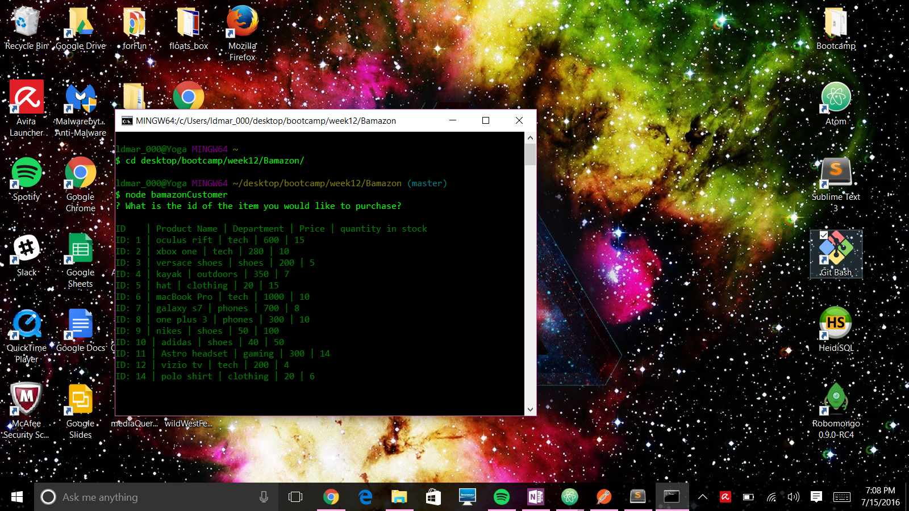
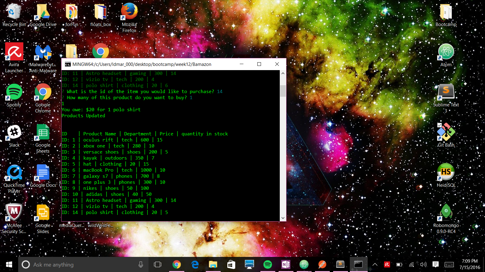
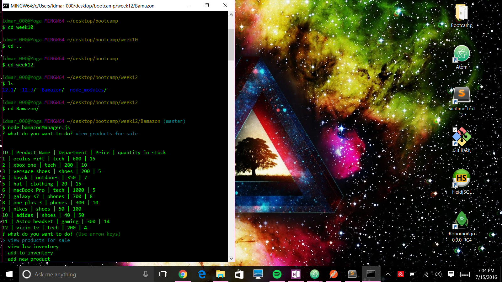
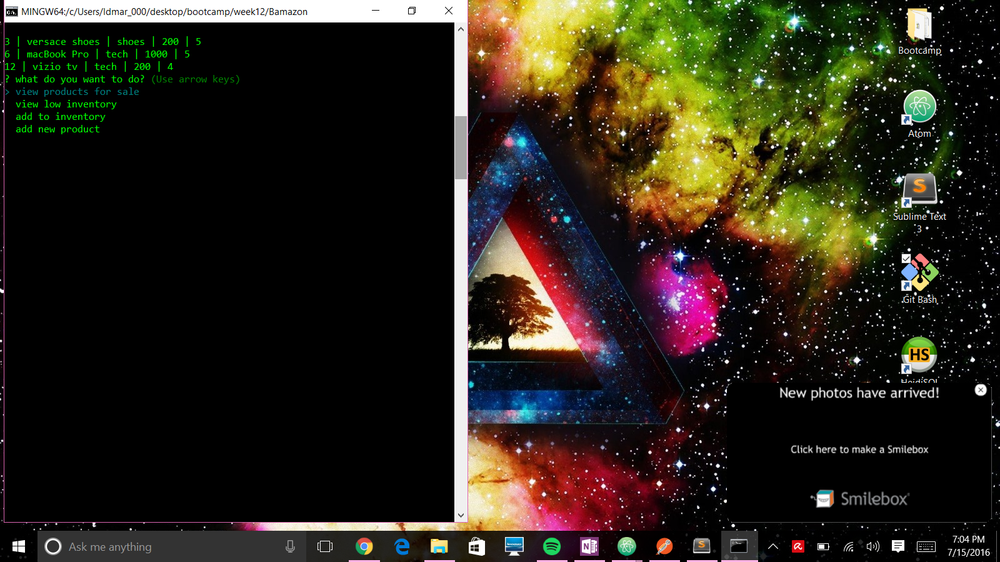
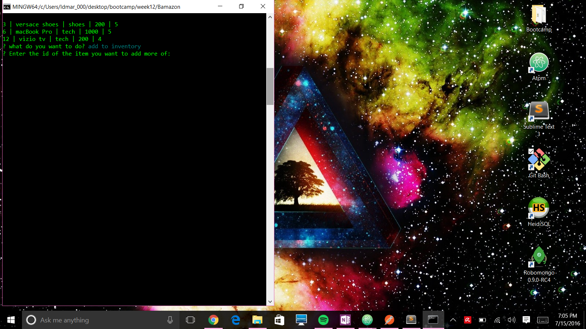
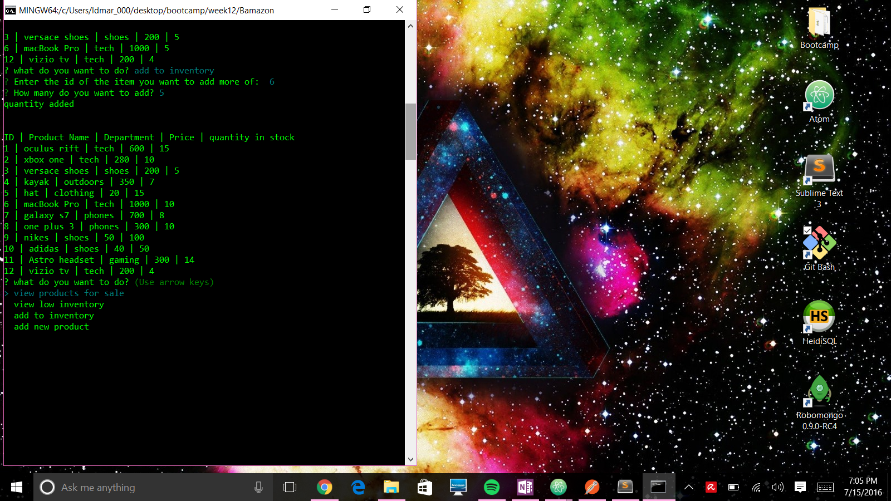

# Bamazon Node App
Node.js and mySQL based storefront
#### To run this app first clone the repo and then install the dependencies.
#### To use bamazon as a customer navigate to the Bamazon directory and then type ```node bamazonCustomer.js``` in your command line.
##### When you run bamazonCustomer.js first it will display a table of the current stock. You are then prompted to enter an item id to buy. After entering an item ID you must then enter the quantity you wish to purchase of the item. See below screenshots:



#### To use bamazon as a manager navigate to the bamazon directory and then type ```node bamazonManager.js``` in your command line.
##### When you run bamazonManager.js you are first prompted to view products, view low inventory, add to inventory, or add new product.

##### If the manager selects view products they are shown a table of the entire inventory.

##### If the manager selects view low inventory then they are shown a table of just the inventory that currently has less than 5 in stock.

##### If the manager selects add to inventory then first they are prompted to pick the id of the item they wish to restock

##### The manager is then prompted how many they want to add of the selected item.

##### The manager is then shown the inventory of products with the updated quantity.

##### If the manager selects to add an item they are asked to enter the name of the item, the department of the item, the price of the item, and how many of the  item is being added.

